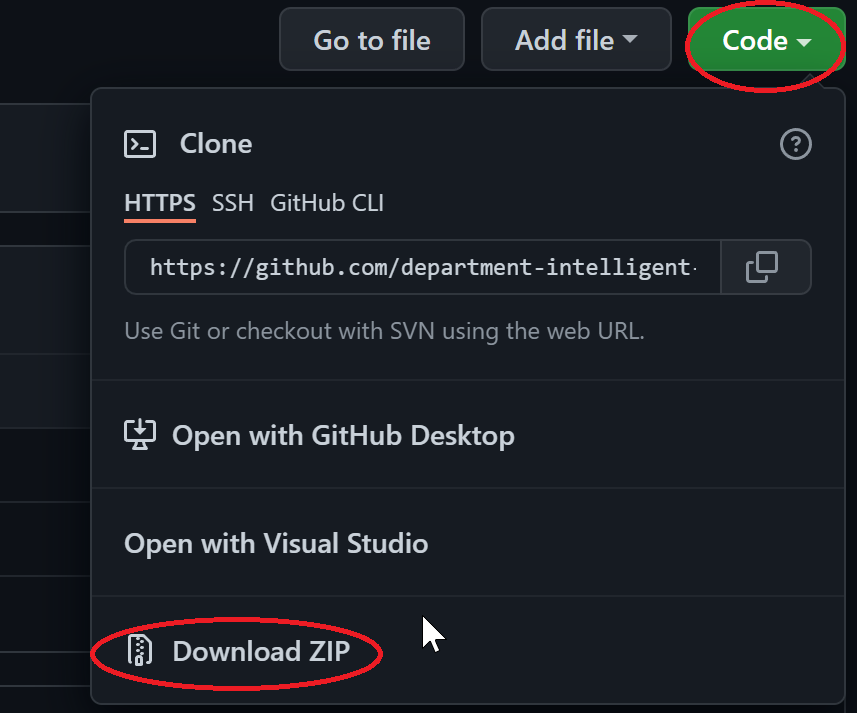
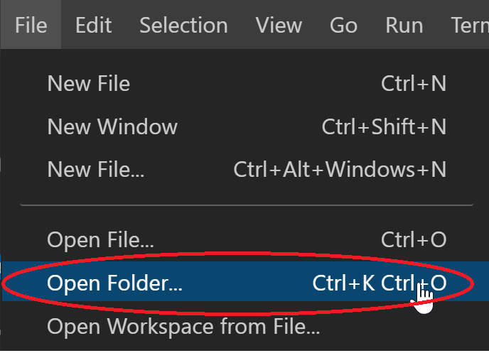
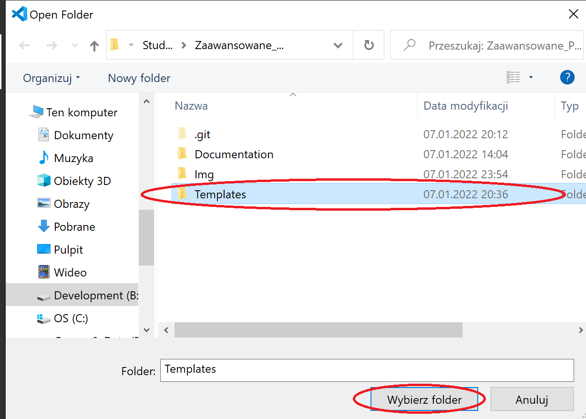
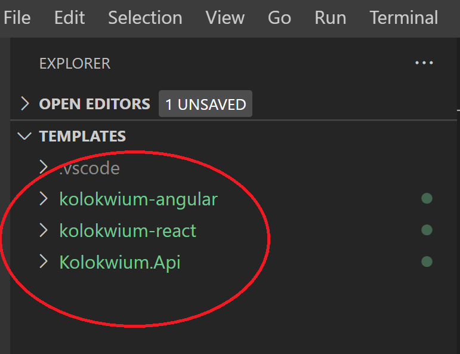

# Kolokwium
## Przygotowanie do kolokwium:
### Pobranie i załadowanie dokumentacji
1) Proszę pobrać gałąź kolokwium w formie pliku zip. A następnie wypakować jego zawartość.
  </img>
2) Proszę uruchomić przeglądarkę i przejść pod adres: [https://devdocs.io/](https://devdocs.io/)
3) Następnie proszę przejść do `Preferences -> Import`.
  
  
4) Proszę wybrać plik `../Documentation/devdocs.json` znajdujący się w pobranym repozytorium.
  
5) W ostatnim kroku proszę się upewnić że wszystkie potrzebne pliki z dokumentacją są zainstalowane.
  
  
  

### Pobranie i przetestowanie szablonów kolokwium
1) Proszę otworzyć folder `Templates` przy pomocy Visual Studio Code.

    </img>

    </img>

    </img>

2) Proszę w Visual Studio Code otworzyć nowy terminal `Terminal -> New Terminal`.


#### Szablon Angular
1) Proszę przejść do folderu `kolokwium-angular` przy pomocy poniższego polecenia.

    ```
    cd kolokwium-angular
    ```
  
2) Nastepnie proszę pobrać wszystkie potrzebne biblioteki przy pomocy `npm`. W tym celu proszę wykonać poniższe polecenie.
  
    ```
    npm install
    ```
  
3) W celu weryfikacji poprawności działania aplikacji proszę ją uruchomić.
  
    ```
    npm start
    ```
  
   Aplikacja powinna być dostępna pod adresem: [http://localhost:4200](http://localhost:4200).
  
4) Jeśli aplikacja działa poprawnie proszę zamknąć przy pomocy kombinacji klawiszy `ctrl + c`.
5) Proszę przejść do folderu wyżej (`Templates`), przy pomocy poniższego polecenia.

    ```
    cd ..
    ```


#### Szablon React
1) Proszę przejść do folderu `kolokwium-react` przy pomocy poniższego polecenia.
  
    ```
    cd kolokwium-react
    ```
    
2) Nastepnie proszę pobrać wszystkie potrzebne biblioteki przy pomocy `npm`. W tym celu proszę wykonać poniższe polecenie.

    ```
    npm install
    ```
    
3) W celu weryfikacji poprawności działania aplikacji proszę ją uruchomić.

    ```
    npm start
    ```

   Aplikacja powinna być dostępna pod adresem: [http://localhost:3000](http://localhost:3000).
  
4) Jeśli aplikacja działa poprawnie proszę zamknąć przy pomocy kombinacji klawiszy `ctrl + c`.
5) Proszę przejść do folderu wyżej (`Templates`), przy pomocy poniższego polecenia.

    ```
    cd ..
    ```


#### Szablon Web API
1) Proszę przejść do folderu `Kolokwium.Api` przy pomocy poniższego polecenia.

    ```
    cd Kolokwium.Api
    ```
  
2) W celu weryfikacji poprawności działania aplikacji proszę, ją uruchomić.

    ```
    dotnet run
    ```
  
   Web API powinno być dostępne pod adresem: `http://localhost:5000/api/{controller}` 
   
   Aplikacja Swagger jest dostępna pod adresem: [http://localhost:5000/swagger](http://localhost:5000/swagger).
  
  
4) Jeśli aplikacja działa poprawnie proszę zamknąć przy pomocy kombinacji klawiszy `ctrl + c`.
5) Proszę przejść do folderu wyżej (`Templates`), przy pomocy poniższego polecenia.

    ```
    cd ..
    ```

```diff
- Życzę Państwu powodzenia na kolokwium! :)
```
